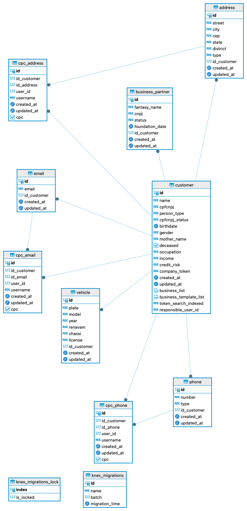
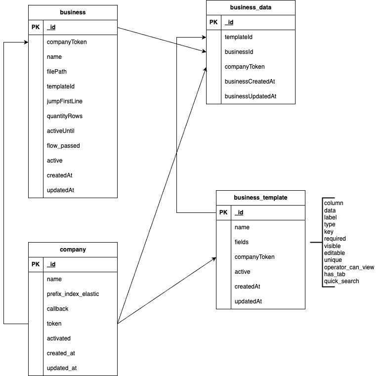
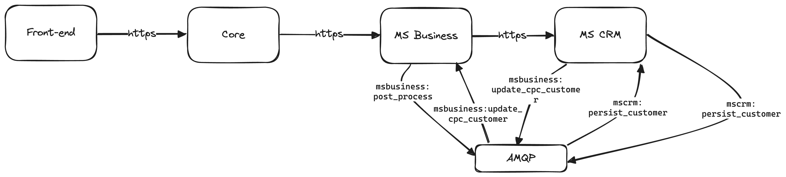

# CRM V2

# Banco de dados

**PostgreSQL**



**MongoDB**



# Diagrama de componentes



# Endpoints MS Business

## Company

- POST /api/v2/companies
  - Endpoint para criar uma company para o ambiente que irá utilizar o CRM
  - O **token** gerado por este endpoint é o mesmo utilizado no MS CRM
  - **prefix_index_elastic** e **callback**: não utilizados
- PUT /api/v2/companies
  - Endpoint para atualizar uma company
- GET /api/v2/companies
  - Endpoint para listar as companies criadas
- GET /api/v2/companies/:id
  - Endpoint para consultar uma company pelo ID

## Template

- POST /api/v2/templates
  - Endpoint para criar um template
  - O **name** do template é único para cada company
- GET /api/v2/templates
  - Endpoint para listar os templates criados
- GET /api/v2/templates/:id
  - Endpoint para buscar um template pelo ID
- GET /api/v2/templates/:id/business_active
  - Endpoint para listar os mailings ativos que são relacionados ao template com o ID informado
- GET /api/v2/templates/:id/without_tags
  - Endpoint para buscar um template e mostrar os campos sem as tags
- POST /api/v2/templates/:id/data/paginated?page=0&limit=20
  - Endpoint para filtrar dados dos mailings de um template
  - No corpo da requisição deve ser enviado um objeto com os filtros e parâmetros de ordenação. Abaixo um exemplo:
  ```json
  {
    "sort_by": [
      {
        "name": "asc"
      }
    ],
    "filter_rules": [
      {
        "condition": "ONLY",
        "rules": [
          {
            "field": "email_address",
            "value": "usuario@digitalk.com.br",
            "condition": "EQUAL"
          }
        ]
      }
    ]
  }
  ```
  - O resultado é paginado usando os parâmetros **page** (número da página) e **limit** (quantidade de linhas por página) é possível calibrar o retorno
- POST /api/v2/templates/:id/data/export?email=<email>
  - Endpoint para filtrar dados dos mailings de um template e enviar uma planilha Excel para o e-mail informado
  - O payload a ser enviado é o mesmo do endpoint acima
- POST /api/v2/templates/:id/customers
  - Endpoint para buscar clientes pelo ID, este ID inteiro é referente ao cadastro realizado no MS CRM. Abaixo um exemplo de payload:
  ```json
  {
    "customers_search": [4076669]
  }
  ```
- GET /api/v2/templates/:id/data_export?email=<email>
  - Endpoint para gerar uma planilha com todos mailings do template e enviar para o e-mail informado
- GET /api/v2/templates/:id/data_export/download
  - Endpoint que gera uma planilha com todos mailings do template, faz upload no AWS S3 e disponibiliza a URL para download
- PUT /api/v2/templates/:id
  - Endpoint para atualizar um template
- PUT /api/v2/templates/:id/activate
  - Endpoint para reativar um template existente
- PUT /api/v2/templates/:id/deactivate
  - Endpoint para desativar um template existente

## Mailing (ou Business)

- POST /api/v2/business
  - Endpoint para importar um arquivo CSV de mailing para um template especificado a partir do upload de arquivo
- POST /api/v2/business_json
  - Endpoint para importar vários registros JSON para um template especificado
- POST /api/v2/business_single_register
  - Endpoint para importar apenas um registro JSON para um template específico
- POST /api/v2/business_url_file
  - Endpoint para importar um arquivo CSV de mailing para um template especificado a partir de uma URL pública
- GET /api/v2/business
  - Endpoint para listar os 20 primeiros mailings importados na company
- GET /ap/v2/business_all_activated
  - Endpoint para listar todos mailings ativos importados na company
- GET /api/v2/business/:id
  - Endpoint para buscar os registros de um mailing específico
- PUT /api/v2/business/:id/activate
  - Endpoint para reativar um mailing que foi desativado
  - Ao reativar deve-se informar uma data para que o mailing possa ser desativado automaticamente
- PUT /api/v2/business/:id/deactivate
  - Endpoint para desativar um mailing que está ativo
- PUT /api/v2/business/:id/mark_flow_passed
  - Endpoint para marcar um mailing indicando que este foi utilizado em uma campanha no Smartflow
- PUT /api/v2/business/:id/unmark_flow_passed
  - Endpoint para desmarcar um mailing que foi utilizado em uma campanha no Smartflow
- GET /api/v2/business/:mailingId/data/:registroId
  - Endpoint para buscar um registro de um mailing específico
- PUT /api/v2/business/:mailingId/data/:registroId
  - Endpoint para atualizar os dados de um registro de um mailing específico
- GET /api/v2/business/:mailingId/data/:registroId/customer_info
  - Endpoint para buscar um registro de um mailing específico junto com os dados de cadastro do cliente salvos no MS CRM
- GET /api/v2/business/search?cpfcnpj=<cpf e cnpj>
  - Endpoint para pesquisar registros importados usando o CPF/CNPJ
- POST /api/v2/business/get_pool_data
  - Endpoint para listar registros a partir de uma lista de objetos informados no payload
  - O payload deve ter uma lista de objetos contendo:
    - **schama**: ID do template
    - **lote_id**: ID do mailing
    - **item_id**: ID do registro no mailing
  - O campo fields indica quais campos do template deseja visualizar nos registros retornados
  - Abaixo um exemplo de payload:
  ```json
  {
    "data": [
      {
        "schama": "60355684d7b62b0bb60b5a1a",
        "lote_id": "60355e90d7b62b0bb60b5a1b",
        "item_id": "e46cd194bbcc6549d275748d2379f29b"
      },
      {
        "schama": "60355684d7b62b0bb60b5a1a",
        "lote_id": "60355e90d7b62b0bb60b5a1b",
        "item_id": "f4deeb633c293dbef98f4cc1929f8f5a"
      }
    ],
    "fields": ["*"]
  }
  ```
- POST /api/v2/business/:id/export_errors
  - Endpoint para exportar os erros encontrados durante a importação de um arquivo de mailing
- POST /api/v2/business/:id/dta/export?email=<email>
  - Endpoint para gerar uma planilha com os registros de uma mailing e enviar para o e-mail informado
- POST /api/v2/business/:id/data/export/raw?email=<email>
  - Endpoint para exportar os registros de um arquivo de mailing importado e enviar para o e-mail informado. Os dados serão enviados da mesma forma que foram recebidos na plataforma.
- POST /api/v2/business/full_search
  - Endpoint para pesquisar em todos mailings do template informado a ocorrência do valor especificado.
  - Exemplo de payload enviado:
  ```json
  {
    "template_id": "61fd1c58e285152e30133c4b",
    "search_params": {
      "value": "forten" // valor a ser pesquisado
    }
  }
  ```
- GET /api/v2/business/paginated?page=0&limit=10
  - Endpoint para listar os mailings importados na company
  - A paginação pode ser parametrizada usando o page e limit
- GET /api/v2/business/activated?page=0&limit=10
  - Endpoint para listar os mailings ativos importados na company
  - A paginação pode ser parametrizada usando o page e limit
- GET /api/v2/business/inactivated?page=0&limit=10
  - Endpoint para listar os mailings desativados importados na company
  - A paginação pode ser parametrizada usando o page e limit
- POST /api/v2/business/:id/fields/paginated?page=0&limit=10
  - Endpoint para filtrar registros dentro de um mailing e retorná-los de forma paginada
  - Um exemplo de payload enviado:
  ```json
  {
    "fields": [
      // lista de campos que serão retornados
      "name",
      "cpf_cnpj"
    ],
    "filter_rules": [
      {
        "condition": "ONLY",
        "rules": [
          {
            "key": "data_de_vencimento", // campo a ser usado para aplicar o filtro
            "value": "+5", // valor do filtro
            "condition": "EQUAL_CALC" // filtro
          }
        ]
      }
    ]
  }
  ```
  - A paginação pode ser parametrizada usando o page e limit
- GET /api/v2/business/:id/info
  - Endpoint para buscar as informações do mailing especificado apontando:
    - quantidade de registros
    - data/hora criação
    - template
    - data/hora de expiração

## Customer (cliente)

- POST /api/v2/customers
  - Endpoint para criar um registro de customer diretamente no MS CRM.
  - O payload deve conter um objeto contendo os campos reservados do cadastro de cliente. Abaixo um exemplo:
  ```json
  {
    "customer_cpfcnpj": "880.102.873-34",
    "customer_name": "Cliente 1",
    "customer_email": [{ "customer_email": "cliente1@gmail.com" }]
  }
  ```
- POST /api/v2/customers/:id
  - Endpoint para atualizar um registro de customer diretamente no MS CRM.
  - O ID informado é inteiro e se refere ao cadastro do cliente no MS CRM.
  - O payload deve conter um objeto contendo os campos reservados do cadastro de cliente. Abaixo um exemplo:
  ```json
  {
    "customer_cpfcnpj": "880.102.873-34",
    "customer_name": "Cliente 1",
    "customer_email": [{ "customer_email": "cliente1@gmail.com" }]
  }
  ```
- GET /api/v2/customers/paginated?page=0&limit=10
  - Endpoint para listar todos clientes da company
  - A paginação pode ser parametrizada usando o page e limit
- GET /api/v2/customers?cpfcnpj=<cpf e cnpj>
  - Endpoint para pesquisar clientes usando o CPF/CNPJ
- POST /api/v2/customers/pool_info

  - Endpoint para pesquisar clientes a partir de uma lista de CPF/CNPJ
  - Abaixo um exemplo de payload:

  ```json
  {
    "cpfcnpj_list": ["12345678989", "12345678990", "12345678991"]
  }
  ```

- GET /api/v2/customers/:id/formatted
  - Endpoint para buscar um cliente pelo ID e formatar o retorno de acordo com os campos padrão
- GET /api/v2/customers/:customerId/template/:templateId
  - Endpoint para buscar um cliente pelo ID que tenha registro nos mailings do template informado
- GET /api/v2/customers/search?search=<termo pesquisa>&show_disabled=false
  - Endpoint para pesquisar um cliente usando o termo de pesquisa que tenha mailings importados na plataforma
  - O parâmetro show_disabled indica se deve listar também os mailings desativados ou apenas os ativos

# Endpoints MS CRM

## Customer

- POST /api/v1/customers
  - Endpoint para criar uma lista de customers usando os campos padrão informados
- POST /api/v1/customer
  - Endpoint para criar um customer usando os campos padrão informados
- GET /api/v1/customers?cpfcnpj=<cpf e cnpj>
  - Endpoint para pesquisar customers usando CPF/CNPJ
- GET /api/v1/customers/:id
  - Endpoint para buscar um customer por ID
- GET /api/v1/customers/:id/formatted
  - Endpoint para buscar um customer por ID formatando o retorno para usar os campos padrão
- GET /api/v1/customers/search?search=<termo de pesquisa>
  - Endpoint para pesquisar customers a partir do termo de pesquisa
- GET /api/v1/customers/all
  - Endpoint para listar todos customers da company
- PUT /api/v1/customers/:id
  - Endpoint para atualizar um customer usando os campos padrão informados

## Email

- POST /api/v1/customers/:customerId/emails
  - Endpoint para criar um email para o customer com o ID informado
- PUT /api/v1/customers/:customerId/emails/:emailId
  - Endpoint para atualizar um email para um customer específico
- GET /api/v1/customers/:customerId/emails
  - Endpoint para listar emails de um customer específico

## Phone

- POST /api/v1/customers/:customerId/phones
  - Endpoint para criar um phone para o customer com o ID informado
- PUT /api/v1/customers/:customerId/phones/:phoneId
  - Endpoint para atualizar um phone para um customer específico
- GET /api/v1/customers/:customerId/phones
  - Endpoint para listar todos phones de um customer específico

## Vehicle

- POST /api/v1/customers/:customerId/vehicles
  - Endpoint para criar um vehicle para o customer com o ID informado
- PUT /api/v1/customers/:customerId/vehicles/:vehicleId
  - Endpoint para atualizar um vehicle para um customer específico
- GET /api/v1/customers/:customerId/vehicles
  - Endpoint para listar os vehicles de um customer específico

## Address

- POST /api/v1/customers/:customerId/addresses
  - Endpoint para criar um address para o customer com o ID informado
- PUT /api/v1/customers/:customerId/addresses/:addressId
  - Endpoint para atualizar um address para um customer específico
- GET /api/v1/customers/:customerId/addresses
  - Endpoint para listar os addresses de um customer específico

## Business Partner

- POST /api/v1/customers/:customerId/business_partners
  - Endpoint para criar um business partner para o customer com o ID informado
- PUT /api/v1/customers/:customerId/business_partners/:businessPartnerId
  - Endpoint para atualizar um business partner de um customer específico
- GET /api/v1/customers/:customerId/business_partners
  - Endpoint para listar todos business partners de um customer específico

# Regras

## Tipos de dados

Os tipos de dados que temos disponíveis são:

| Tipo             | Descrição                                                                         |
| ---------------- | --------------------------------------------------------------------------------- |
| text             | Tipo de dados para texto sem limite de tamanho                                    |
| string           | Texto com limite de 255 caracteres                                                |
| int              | Número inteiro                                                                    |
| array            | Lista de itens                                                                    |
| boolean          | Valores verdadeiro/falso                                                          |
| cpfcnpj          | CPF/CNPJ                                                                          |
| cep              | CEP                                                                               |
| phone_number     | Número de telefone                                                                |
| decimal          | Número decimal                                                                    |
| email            | Email                                                                             |
| options          | Lista de opções                                                                   |
| date             | Data                                                                              |
| timestamp        | Data/Hora                                                                         |
| time             | Hora                                                                              |
| table            | Tabela (utilizado para formatação apenas)                                         |
| multiple_options | Múltiplas opções                                                                  |
| document         | Documento                                                                         |
| list_document    | Lista de documentos                                                               |
| tag              | Tag (utilizado para organizar os campos na exibição dos dados)                    |
| responsible      | Responsável (indica o ID do usuário)                                              |
| cep_distance     | Armazena a distância entre dois CEPs                                              |
| register_active  |                                                                                   |
| opt_in           | Armazena os dados de opt-in                                                       |
| numeric_calc     | Campo que iarmazena fórmula para realizar cálculos a partir de campos do template |
| percentual       | Armazena dados de percentual                                                      |

# Dicionário

- **Mailing**: também chamado de business ou lote, é um conjunto de registros importados usando um template no CRM.
- **Template**: estrutura contendo uma lista de campos e suas definições que formatam os dados armazenados no CRM, definindo o isolamento dos dados e critérios para inserção/consulta
- **Tag**: é um tipo de campo do template que não recebe dados, apenas permite a organização na exibição dos dados no front-end
- **Registro**: também chamado de item, é a linha de dados de um mailing que é importado no CRM
- **Customer**: é o mesmo que cliente
- **Vehicle**: é o mesmo que veículo do cliente
- **Address**: é o mesmo que endereço do cliente
- **Business partner**: se refere às empresas que o cliente está vinculado como sócio.

# CRM

### Conceitos

- **Dados de negócio**: são todos os dados que não se referem ao cliente em si, mas aos produtos ou informações que ele usa.
- **Dados de cadastro**: são todos os dados cadastrais do cliente como nome, CPF/CNPJ, gênero e etc.
- **Dados de contato**: são todos os dados que permitem contactar o cliente como telefone, e-mail, endereço e etc.

### Arquitetura

O CRM como um serviço abrange dois microserviços: [**ms-business**](https://github.com/estanisquevedo/ms-business) e [**ms-crm**](https://github.com/estanisquevedo/ms-crm).

#### ms-business

Este microserviço salva os dados no MongoDB e guarda os arquivos de lotes enviados no S3.
Tem as sequintes responsabilidades:

1. Gerenciar as campanies
2. Gerenciar os templates
3. Receber, tratar e guardar os lotes de dados originais e tratados
4. Fazer proxying como microserviço ms-crm, sendo que nenhuma requisição chega diretamente no ms-crm, antes precisa obrigatoriamente passar pelo ms-business

#### ms-crm

Este microserviço salva os dados no PostgreSQL e mantém dados resumidos no ElasticSearch para realizar search dos clientes sem precisar bater no banco de dados diretamente.
A única responsabilidade é manter os dados de cadastro e contato dos clientes.

[Mais detalhes](https://github.com/estanisquevedo/ms-crm/blob/master/README.md)

### Sobre o ms-business

Para realizar qualquer ação é necessário enviar um token de identificação da company relacionada no header da requisição, exceto quando realiza alguma ação relacionada a company.
Para ter um token é preciso cadastrar uma company, com o seguinte método

Endpoint: POST /api/v1/companies
Content-type: application/json

Parâmetros
| Parâmetro | Descrição | Obrigatório |
| --------- | --------- | ----------- |
| name | Nome da company | SIM|
| prefix_index_elastic| Prefixo para indexar os dados no ElasticSearch|SIM|
| callback| URL retorno após alguma chamada assíncrona|SIM|
